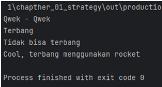

# Analisa
## Duck.java
- memisahkan perilaku suara dan terbang bebek ke dalam objek yang berbeda
- Terdapat dua interface, QuackBehavior dan FlyBehavior, yang diimplementasikan oleh beberapa kelas seperti Quack, Squeak, MuteQuack, FlyWithWings, FlyNoWay, dan FlyWithRocketPower
- Kelas abstrak Duck memiliki variabel instance QuackBehavior dan FlyBehavior, serta metode abstract display, swim, performQuack, performFly, setFlyBehavior, dan setQuackBehavior
- Kelas turunan seperti MallarDuck, ReadheadDuck, WoodenDuck, dan ModelDuck mewarisi perilaku-perilaku bebek dari kelas Duck dan memberikan perilaku serta implementasi khusus.
- ini merupakan struktur program yang menggunakan pola desain Strategy untuk memisahkan dan memilih perilaku suara dan terbang bebek secara dinamis. Dengan cara ini, setiap bebek dapat memiliki perilaku yang berbeda tanpa harus mengubah struktur kelas.
  

## Tugas.java
- Terdapat tiga jenis pembayaran yang diimplementasikan sebagai kelas-kelas yang mengimplementasikan antarmuka PaymentStrategy: CreditCardPayment, PayPalPayment, dan BitcoinPayment.
- Kelas ShoppingCartContext bertindak sebagai konteks yang menggunakan PaymentStrategy yang dipilih untuk melakukan pembayaran saat checkout.
- Pengguna dapat memilih metode pembayaran yang diinginkan saat melakukan pembayaran di keranjang belanja.
  